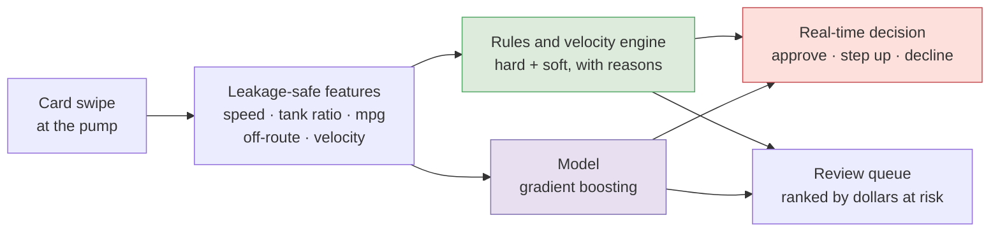
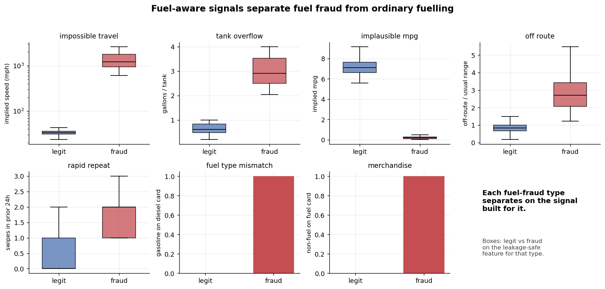
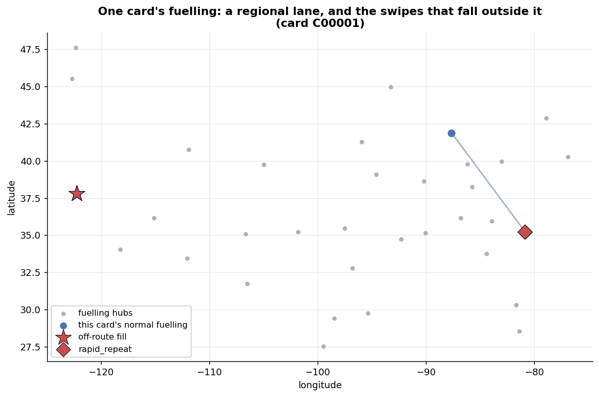
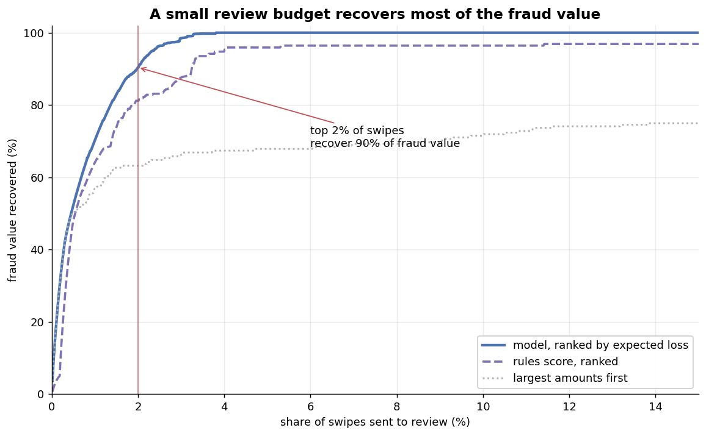
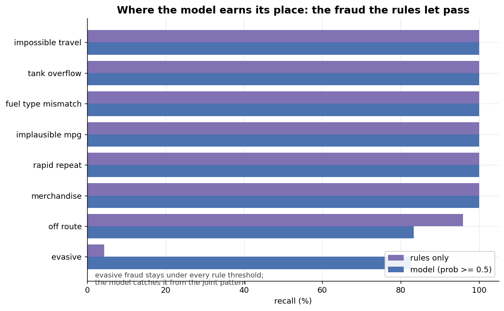

# Fuel-Card Fraud Monitoring

Catching the fraud a fuel card actually sees, at the moment of the swipe, with a reason a
person can read.

A general card-fraud model treats a diesel purchase as one more transaction and misses the
fraud that is specific to fuel: gallons that exceed the truck's tank, a diesel rig's card
buying gasoline, a card used two states apart within the hour, fuel bought but never
burned, non-fuel merchandise on a fuel-restricted card. This tool is built around those
fuel semantics. It pairs a transparent rules-and-velocity engine, the layer a risk team
deploys and can defend, with a leakage-safe model for the combinations no single rule
catches, and it prices every alert by the dollars at risk so a review team spends its time
where the loss is.

No issuer publishes labelled fuel-card fraud, so the project runs on a schema-faithful
generator that models fleets running realistic lanes and injects the fraud a fuel-card team
fights. Every number below is from that synthetic data, and the write-up says so wherever
it quotes one.

## How it works



Both layers read the same leakage-safe features. The rules make deterministic, explainable
calls in real time and carry the reasons; the model ranks the softer cases the rules pass;
the decision and the queue draw on both. All numbers below are out of time, from a model
trained on the earlier part of the data and evaluated on the later part.

## The signals that make it fuel-aware



Each panel is one fraud type against the leakage-safe feature built for it, legitimate
fuelling in blue and fraud in red. The separations are what let simple, explainable rules
do most of the work: a truck cannot average ninety miles an hour between fills, cannot put
three tanks of diesel into one tank, cannot drive a hundred and fifty gallons' worth of
miles on an odometer that barely moved.

| Fraud type | What it is | Fuel-aware signal | Example reason on the alert |
| --- | --- | --- | --- |
| Impossible travel | The card is used in two places too far apart for the time between | Implied speed between consecutive fills on the card | `card used 2286 mi away 1.0 h earlier (implied 2377 mph)` |
| Tank overflow | Gallons far exceed the truck's tank, so fuel is siphoned or resold | Gallons over the truck's tank size | `788 gal exceeds the 200 gal tank` |
| Fuel-type mismatch | A diesel truck's card buys gasoline, so a personal vehicle is being filled | Product against the card's fuel type | `unleaded bought on a diesel card` |
| Implausible economy | Fuel is bought but not burned | Miles per gallon implied by the odometer move | `implied 0.2 mpg on a 125 gal fill` |
| Rapid repeat | A burst of swipes at one site within minutes | Time and distance since the last swipe, and trailing count | `repeat swipe 6 min after the last, same site` |
| Merchandise | Non-fuel goods or cash on a fuel-restricted card | Product class | `non-fuel purchase on a fuel-restricted card` |
| Off-route | The card strays far outside its usual operating area | Distance from the card's centre, over that card's own roaming | `1786 mi from this card's usual area, 17.9x its normal range` |

Off-route is deliberately the soft one. Long-haul drivers legitimately roam, so absolute
distance flags them; dividing by each card's own normal range separates a regional card
that has strayed from a long-haul card doing what it always does.



A single card, its ordinary fuelling clustered along a lane, and the swipes that fall
outside it: an off-route fill on the far coast, an impossible-travel swipe, a tank
overflow. This is the picture the off-route and travel signals turn into numbers.

## Results

Trained on the earlier 60% of the data and evaluated on the later 40%, an out-of-time test
of 7,059 swipes at a 2.62% fraud rate.

**Ranking.** The score has to sort fraud above the rest so a review team meets it first.
Measured by PR-AUC, where the no-skill line is the fraud rate:

| Ranker | PR-AUC |
| --- | --- |
| No-skill baseline | 0.026 |
| Rules score alone | 0.753 |
| Model | 0.988 |

**Value recovered at a review budget.** Ranking the queue by expected loss, risk times the
amount exposed, a team that works only the top slice of alerts still recovers most of the
fraud value, because the largest exposures surface first.



| Review budget | Alerts | Fraud value recovered | Fraud count caught |
| --- | --- | --- | --- |
| Top 1% | 71 | 70% | 37% |
| Top 2% | 141 | 90% | 69% |
| Top 5% | 353 | 100% | 100% |

**Where the model earns its place.** The rules catch the blatant fraud at full recall, but
the evasive typology is built to stay under every rule threshold and is anomalous only in
combination. The rules flag almost none of it; the model catches most of it. This is the
case for two layers rather than one.



| Typology | Rules only | Model |
| --- | --- | --- |
| Impossible travel, tank overflow, wrong fuel, implausible economy, rapid repeat, merchandise | ~100% | ~100% |
| Off-route (soft) | 98% | 96% |
| Evasive (under-threshold) | 4% | 83% |

**Real-time decisions.** With hard rules declining deterministically and the model setting
the softer calls, the decline path catches 96% of fraud while declining under 1% of
legitimate swipes; adding step-up verification reaches 98% of fraud while touching about 1%
of legitimate traffic.

Read these for what they are. The fraud is synthetic and the blatant typologies carry
strong signals by construction, so the high recall on them says the pipeline is wired
correctly, not that real adversaries are this easy. The numbers that carry real information
are the ones with room to be wrong: the model's 83% on evasive fraud against the rules' 4%,
and the sub-1% false-decline rate at the operating point. Real fuel-card fraud is
adversarial and shifts as controls tighten, and no synthetic result changes that.

## Leakage discipline

Every feature that depends on history uses only a card's transactions strictly before the
current swipe: the previous location and time for travel speed, the previous odometer for
fuel economy, the running centre of prior fills for off-route distance, counts over a
trailing window for velocity. An authorisation decision cannot see a card's later activity,
so a feature that did would score well in a notebook and fail in production.

The guard is a test, not a sentence in a README. Features computed on a time-prefix of the
data must equal the features on the full data for those same early rows, so no value can
depend on the future:

```python
def test_features_use_no_future_info():
    full, cols = features.build_features(df)
    for k in (200, 600, 1200):
        prefix, _ = features.build_features(df.iloc[:k])
        assert np.allclose(full[cols].iloc[:k], prefix[cols], equal_nan=True)
```

## How the synthetic data is built

Because there is no public dataset, the realism of the generator is what makes the results
mean anything, so it is modelled with care (`fuelguard.fuel_data`):

- **Fleets and trucks.** Forty fleets of drivers, each with a home hub among 34 US fuelling
  cities, a tank of 120 to 300 gallons, and a fuel economy of 5.8 to 7.2 mpg.
- **Lanes.** Most drivers run regional lanes inside an operating radius; about a quarter are
  long-haul and roam widely. This is what gives off-route a meaning: a fill outside a
  regional card's lane is an anomaly, the same fill for a long-haul card is not.
- **Legitimate fuelling.** Trucks hop hub to hub roughly every 950 miles, fill to a
  realistic fraction of the tank at that region's diesel price, and their odometer advances
  in step, so implied economy lands near their true mpg.
- **The fraud.** Seven typologies are injected with labels, attached to real cards near real
  activity. Legitimate traffic is kept deliberately non-trivial, fills approach tank size
  and long-haul drivers cover the map, so no single rule separates fraud for free.

## Why it is built this way

Two layers, because the two jobs are different. Rules carry the cases that should never
need a model to see and must be explainable when a driver is declined at three in the
morning; the model carries the cases that only appear when several weak signals line up.
Ranking by dollars at risk, rather than by score alone, is what lets a fixed review team
recover the most loss per case worked. And every rule and feature is leakage-safe, because
the only honest test of a real-time model is whether it used only what a real-time system
would have.

## What this maps to in operations

- The real-time decision is the authorisation path: approve, step up to a prompt, or
  decline at the pump.
- The reason on every alert is what an investigator reads and what an adverse-action notice
  to the driver would contain.
- The review queue is the analyst's day, ordered so the largest exposures surface first.
- The rule thresholds sit in one block, tuned and audited rather than buried in code.

## Roadmap

The rules engine, the model, the decision path, the cost-ranked queue, and the evaluation
above are all in place. Still to come:

- **Investigation SQL.** Analyst queries over the raw feed for the pattern behind an alert:
  a card's fills either side of a flagged swipe, a fleet's overnight manual entries, the
  sites where off-route fills cluster.
- **Score calibration.** The model ranks well; before its output is read as a probability
  rather than a rank, it should be calibrated, and that calibration checked over time.
- **Threshold tuning by cost.** The decline and step-up cut-offs are set sensibly; tying
  them to the modelled cost of a false decline against a missed fraud would set them by
  policy rather than by hand.

## Limitations

- **Synthetic data.** The generator is faithful to the schema and the physics, not a real
  fraud population; real fuel-card fraud is adversarial and shifts as controls tighten.
- **Off-route is soft.** Geography alone cannot separate a strayed regional card from a
  long-haul run with certainty; it is corroboration, not a verdict.
- **Odometer coverage.** The implied-economy signal needs an odometer read at the pump,
  which real feeds capture inconsistently; where it is missing the signal is simply absent.

## Run it

```bash
python -m venv .venv && source .venv/bin/activate
pip install -e ".[dev]"
make test                     # includes the no-lookahead guard
python run_demo.py            # features and the rules engine
python run_model.py           # model, decision, queue, and the evaluation above
python scripts/make_figures.py
```

With no feed present, everything runs on the mock. To score your own data, drop a CSV at
`data/transactions.csv` in the format described in [`data/README.md`](data/README.md).

## Repository structure

```
.
├── src/fuelguard/
│   ├── fuel_data.py     # schema-faithful generator + loader
│   ├── features.py      # leakage-safe fuel-aware features
│   ├── rules.py         # transparent rules and velocity engine with reasons
│   ├── model.py         # time-split, class-weighted gradient boosting
│   ├── scoring.py       # decision (approve/step up/decline) + cost-ranked queue
│   └── metrics.py       # PR-AUC, per-typology recall, value at budget
├── tests/               # leakage guard, feature checks, rule and model coverage
├── scripts/
│   └── make_figures.py  # README figures
├── run_demo.py          # rules-layer report on the data
├── run_model.py         # model, decision, queue, and evaluation
├── data/README.md       # input format
└── docs/img/            # figures
```

## Data and licence

The code is released under the MIT License (see `LICENSE`). The data is generated by this
repository and carries no third-party licence. Raw CSVs are git-ignored.
